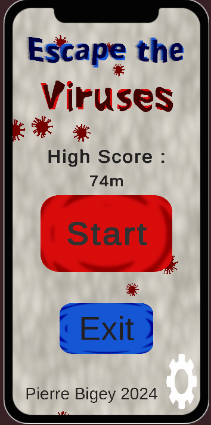
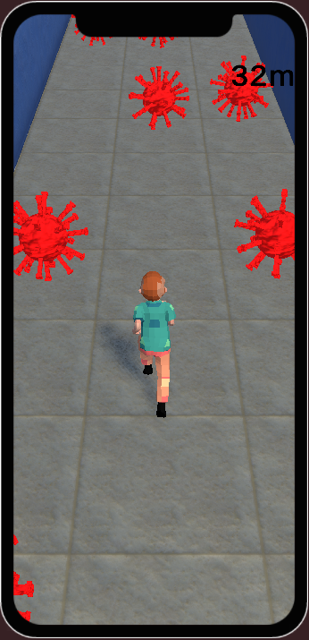
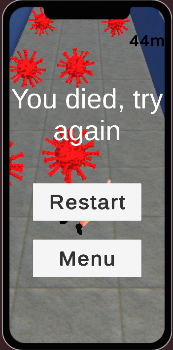
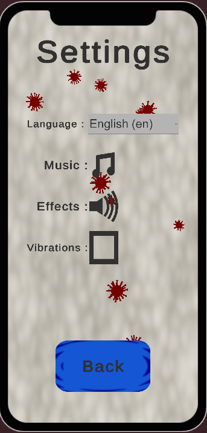

# Escape The Viruses 🏃‍♂️💨🦠

## Overview
"Escape The Viruses" is an exciting endless runner mobile game designed for Android devices. In this fast-paced adventure, you control a brave little boy racing through a hospital corridor, facing the challenge of escaping viruses that appear on his way.

## How to Play 🎮
- **Tap Left or Right:** Control the movement of the player by tapping on the left or right side of the screen.
- **Endless Runner:** Your goal is to go as far as you can in the hospital corridor. The game features progressively increasing speed for added intensity.

## Features 🌟
- **Optimized Graphics:** Experience smooth gameplay with optimized virus models for fluid animation.
- **Endless Challenge:** Test your reflexes and see how far you can go in this endless runner. The speed increases as you progress, providing an ever-growing challenge.
- **Intuitive Controls:** Easy-to-use controls with simple taps for quick and responsive movements.

## Screenshots 📸

## Requirements 📱
- Android 5.1 "Lollipop" (API level 22) or higher.

<!--## Installation 🚀
1. Download the APK file from [Release Page](release_url).
2. Install the APK on your Android device.
3. Enjoy the thrilling adventure of "Escape The Viruses"!-->

## Development Details 🛠️
- **Unity Version:** 2022.3.19
- **Platform:** Android
- **Dependencies:** Unity (version), Android SDK (version)

## Feedback and Issues 🤝
If you encounter any issues or have suggestions for improvement, feel free to [open an issue](https://github.com/Pierre-Bigey/EscapeTheViruses/issues) on our GitHub repository.

© 2024 Pierre Bigey
